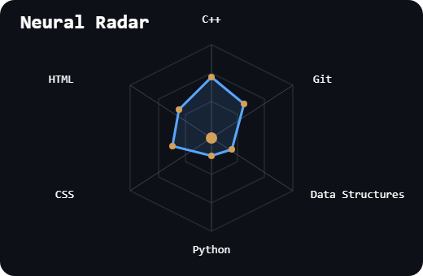
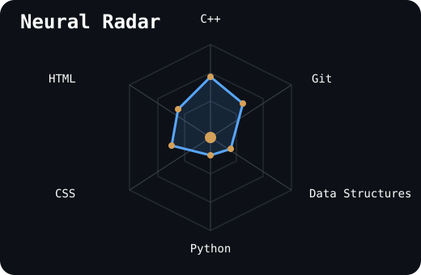

<p align="center">


<br>


</p>

---

<p align="center">

`>> SYSTEM INITIALIZING...`

</p>

<table border="0">
<tr>

<td width="58%" valign="middle">

# Hari G K

### Engineering Student | C++ • DSA • Physics • Mathematics

*"Reality is written in mathematics. Software is how we converse with it."*

> Discipline in the soul. Curiosity in the mind.

Observing reality through mathematics. Building systems through code.

</td>

<td width="42%" align="center">


</td>

</tr>
</table>

<p align="center">

`[ IDENTITY CONFIRMED ] [ CORE SYSTEM ONLINE ] [ CURIOSITY PROTOCOL ACTIVE ]`

</p>

---

<p align="center">

</p>

<box background=surface radius=md border=1 padding=3 gap=2>
  <row justify=between align=center><row gap=2 align=center><icon name=cpu color=info/>

**FIELD MODULE**</row><badge label=ONLINE color=success/></row>

  <caption>Identity confirmed · Research modules loading...</caption></box>

```text
SEEKER       : Hari G K
STATUS       : Engineering Student
MISSION      : Software Engineering • C++ • DSA
COORDINATES  : Earth
TRAJECTORY   : Curiosity → Engineer → Factual Exploration
MANIFESTO    : Understand. Build. Explore.
```

<details>
<summary>FIELD NOTES</summary>

- Building strong foundations in C++ and DSA.
- Interested in mathematics, algorithms and physics.
- Enjoy converting abstract ideas into practical systems.

</details>

---

<p align="center">

</p>

<box background=surface radius=md border=1 padding=3 gap=2>
  <row justify=between align=center><row gap=2 align=center><icon name=atom color=info/>

**RESEARCH MODULE**</row><badge label=ACTIVE color=info/></row>

  <caption>Exploration through mathematics, algorithms and physics.</caption></box>

## Current Focus

- C++ Programming
- Data Structures
- Algorithms
- Mathematics
- Physics
- Real-world Projects

## Questions I Like Exploring

```text
> Why does an algorithm work?

> Can a complex problem become a simple model?

> How does mathematics describe reality?

> What makes a solution elegant?
```

---

<p align="center">

</p>

<box background=surface radius=md border=1 padding=3 gap=2>
  <row justify=between align=center><row gap=2 align=center><icon name=cpu color=info/>

**COMPUTATIONAL CORE**</row><badge label=READY color=success/></row>

  <caption>Languages detected. Tools synchronized.</caption></box>

### Languages

<p align="center">


</p>

### Tools

<p align="center">


</p>

---

<p align="center">

</p>

<box background=surface radius=md border=1 padding=3 gap=3>
  <row justify=between align=center><row gap=2 align=center><icon name=gauge color=info/>

**SKILL DIAGNOSTICS**</row><badge label=ANALYZING color=warning/></row>

  <caption>Current learning depth across your stack.</caption>

  ### Skill Matrix

 ---

<p align="center">

</p>

# ▶ Skill Diagnostics

### Skill Matrix

<p align="center">
  
</p>

---

<p align="center">

</p>

### Neural Radar

<p align="center">
  
</p>

<p align="center">
<sub>Diagnostics reflect current learning depth • Updated throughout the expedition.</sub>
</p>

**MATHEMATICAL MODULE**</row><badge label=ACTIVE color=info/></row>

  <caption>Patterns. Structure. Reality.</caption></box>

| Equation | Perspective |
|-----------|-------------|
| `e^(iπ)+1=0` | Beauty in pure relationships |
| `F=ma` | Motion follows structure |
| `E=mc²` | Hidden connections exist |
| `O(log n)` | Better thinking beats brute force |
| `∇` | Every change has direction |

> Mathematics reveals patterns. Physics describes reality. Algorithms turn logic into action.

---

<p align="center">

</p>

<box background=surface radius=md border=1 padding=3 gap=2>
  <row justify=between align=center><row gap=2 align=center><icon name=rocket color=info/>

**MISSION CONTROL**</row><badge label=TRACKING color=warning/></row>

  <caption>Current objectives and trajectory.</caption></box>

```text
PRIMARY OBJECTIVE
→ Become exceptional at problem solving.

SECONDARY OBJECTIVE
→ Build meaningful software projects.

METHOD

Learn
  ↓
Implement
  ↓
Analyze
  ↓
Improve
  ↓
Repeat
```

---

<p align="center">

</p>

<box background=surface radius=md border=1 padding=3 gap=2>
  <row justify=between align=center><row gap=2 align=center><icon name=route color=info/>

**EXPEDITION MODULE**</row><badge label=ONGOING color=info/></row>

  <caption>Every completed checkpoint moves the expedition forward.</caption></box>

- [x] Git & GitHub
- [x] C++ Fundamentals
- [ ] Complete DSA Roadmap
- [ ] Strengthen Problem Solving
- [ ] Build Better Projects
- [ ] Portfolio Website
- [ ] Explore Open Source

---

<p align="center">

</p>

<box background=surface radius=md border=1 padding=3 gap=2>
  <row justify=between align=center><row gap=2 align=center><icon name=folder color=info/>

**PROJECT MODULE**</row><badge label=BUILDING color=warning/></row>

  <caption>Experiments become systems through iteration.</caption></box>

### Mission 01 — DSA-Cpp

Building strong C++ and algorithm fundamentals.

**Status:** ACTIVE

---

### Mission 02 — Smart Grid

Power management and monitoring project.

**Status:** COMPLETE

---

### Mission 03 — Mini Projects

Experiments while learning.

**Status:** ONGOING

---

### Mission 04 — Portfolio

Personal developer website.

**Status:** IN DEVELOPMENT

---

<p align="center">

</p>

<box background=surface radius=md border=1 padding=3 gap=2>
  <row justify=between align=center><row gap=2 align=center><icon name=activity color=info/>

**TELEMETRY MODULE**</row><badge label=SYNC color=success/></row>

  <caption>GitHub telemetry linked to the current expedition.</caption></box>

<p align="center">


</p>

### Contribution Streak

<p align="center">


</p>

---

<p align="center">

</p>

<box background=surface radius=md border=1 padding=3 gap=2>
  <row justify=between align=center><row gap=2 align=center><icon name=telescope color=info/>

**OBSERVATORY**</row><badge label=OPEN color=info/></row>

  <caption>Curiosity extends beyond software.</caption></box>

| Interest | Inspiration |
|-----------|-------------|
| 🌌 Physics | Understanding reality |
| ∞ Mathematics | Finding hidden patterns |
| 🧭 One Piece | Adventure beyond the horizon |
| ⚔️ Bleach | Discipline and growth |

### Things I Find Fascinating

```text
> BLACK HOLES
  Gravity • Event Horizons • Spacetime

> NEUTRON STARS
  Dense Matter • Magnetism

> STAR CLUSTERS
  Formation • Evolution

> MATHEMATICS
  Logic • Structure

> ALGORITHMS
  Patterns • Efficiency
```

---

<p align="center">

</p>

<box background=surface radius=md border=1 padding=3 gap=2>
  <row justify=between align=center><row gap=2 align=center><icon name=radio color=info/>

**COMMUNICATIONS**</row><badge label=READY color=success/></row>

  <caption>Signals open for collaboration and conversation.</caption></box>

<p align="center">

<a href="mailto:YOUR_EMAIL">

</a>

<a href="YOUR_LINKEDIN">

</a>

<a href="https://github.com/Hariiigk">

</a>

</p>

---

<p align="center">


<br><br>

### "The sea is vast. The universe even more so."

**Discipline in the soul. Curiosity in the mind.**

<sub>Keep exploring.</sub>

<br><br>


</p>
